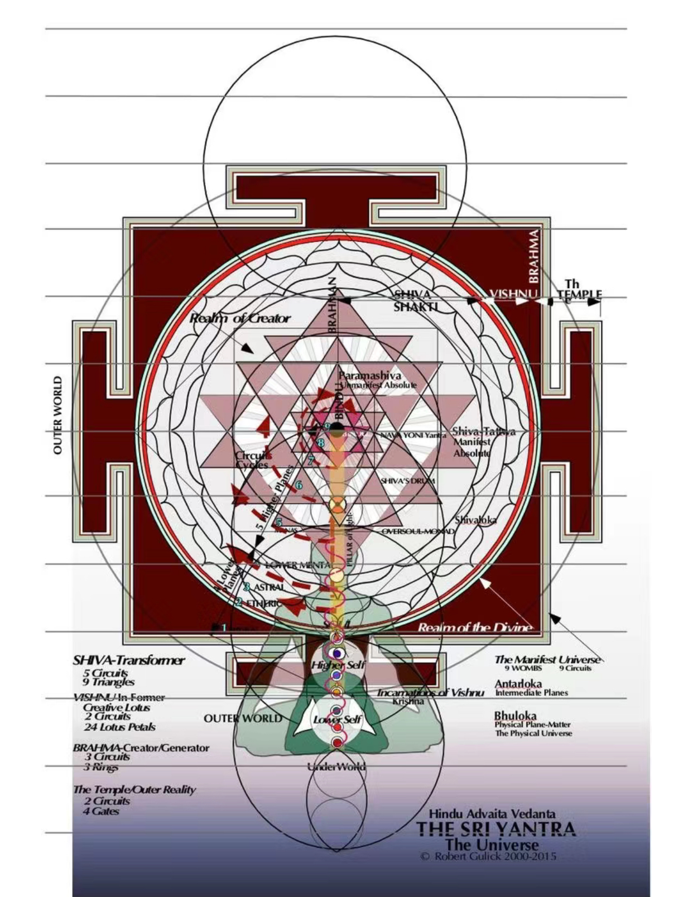
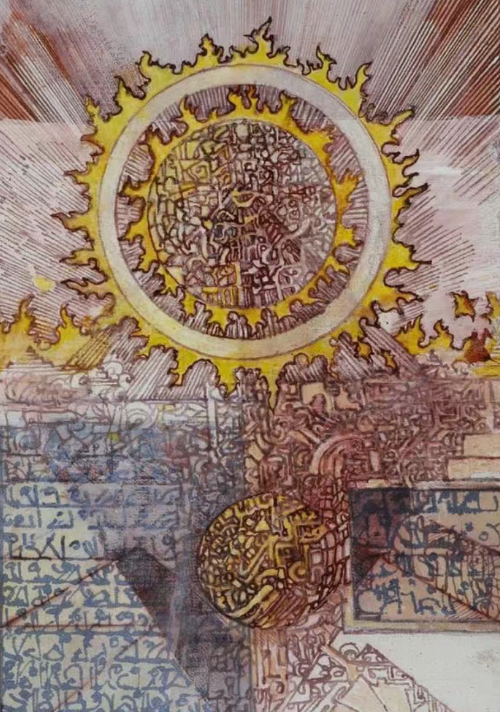
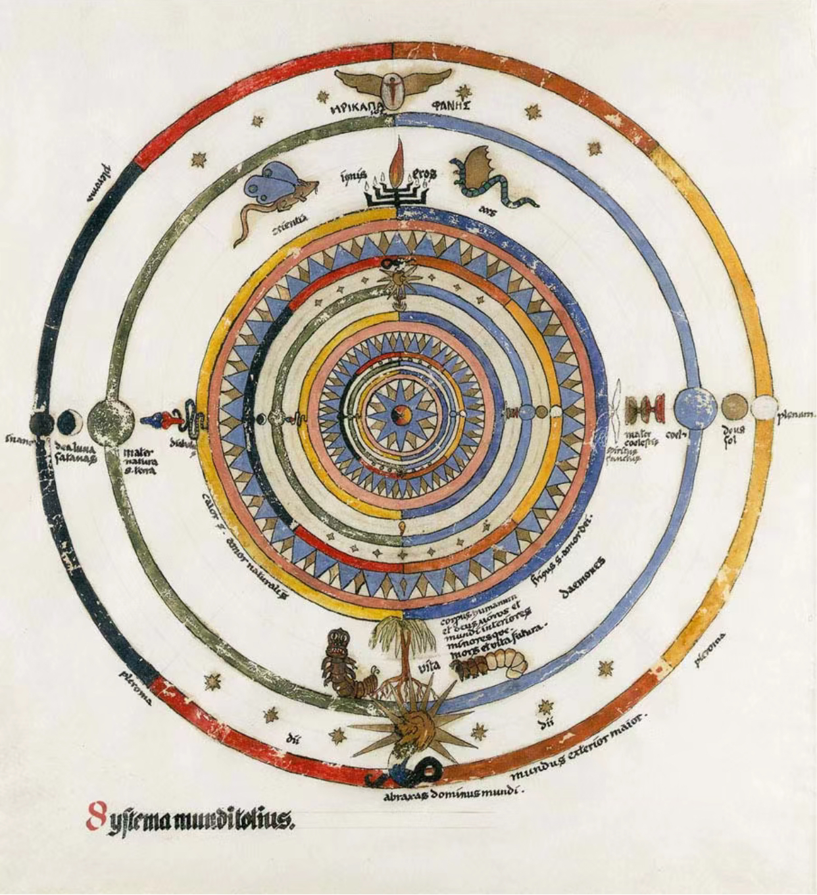
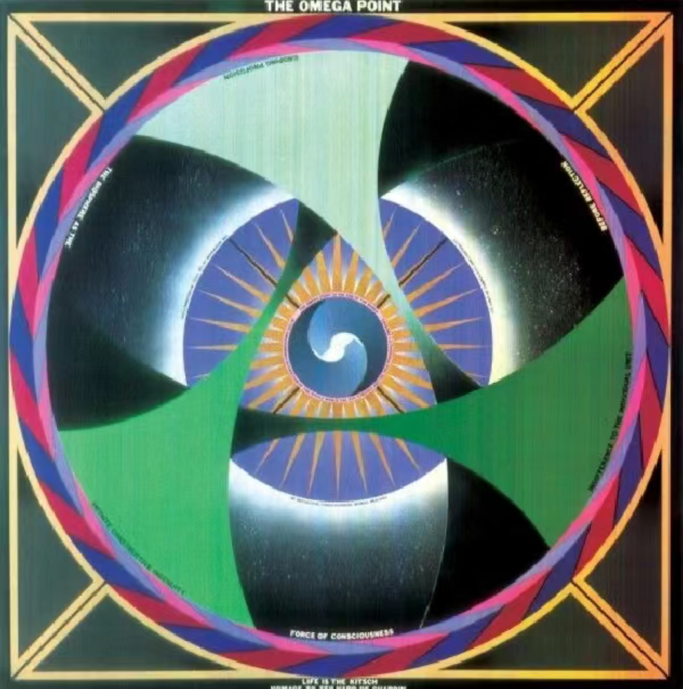

# Animated 'Wheels of fortune' Project - Time-Based

## Instructions on how to interact with the work: 
Once the work is loaded, the time-driven animation of the work will automatically start to loop. You can use the mouse to slowly move to the screen, and then you can see the dynamic effect of the pattern, and the picture will change randomly with each refresh. In addition, every 400 milliseconds, the pattern will rotate and scale according to the timer I designed.

### Personal method of animation code
1. In this task, based on the group's code, I chose "Time-Based" as the way to make the whole pattern animated.

2. The animation is constantly updated through time and timer, which can make the rotation and scaling of the pattern change within the set time interval. The difference between me and other group members is that my animation method is based on time timer and event animation, while other members have chosen different animation methods from me, such as Perlin noise and randomness or audio-driven animation. My design visually presents a rhythmic and regular rhythmic animation, which makes the entire pattern event produce animation effects and visual impact through the flow and rotation of wavy lines, and further highlights the colorful feeling.

3. How inspiration influenced my work: My animation was inspired by some Jungian and Australian artists' mandala artworks, which often use concentric circles and some gradually rotating patterns to give people a calm and rhythmic visual feeling. Here are some reference images (e.g., static pictures or gifs) of inspiration sources, showing how the circles and symmetry in Jungian-inspired mandala art can be rotated and scaled to show the balance of dynamic and static effects.

inspiration images：

4. A brief technical description
Based on the group code, I added the following:
I added a time timer: introduce setInterval, update rotationAngle and scaleFactor every 400 milliseconds, so that the pattern changes over time. I added rotation and scaling animations, adding rotate and scale methods to the draw function to produce rotation and scaling effects based on rotationAngle and scaleFactor.
But in the end, all the changes made to my work maintained the basic style, and the changes I added to the time animation drive made the pattern more rhythmic and dynamic.
More technical notes:
Rotation Angle: Over time, the canvas will continue to rotate in 10 degree increments.
Scale Factor: The canvas will change over time to achieve the overall dynamic effect. Based on the function I added time, it will quickly zoom in and out.
Timer: I used the setInterval function to generate dynamic updates every 400 milliseconds.
Rotation and Scale: In the draw function, I used rotate and scale to make the entire canvas appear smooth and dynamic.

